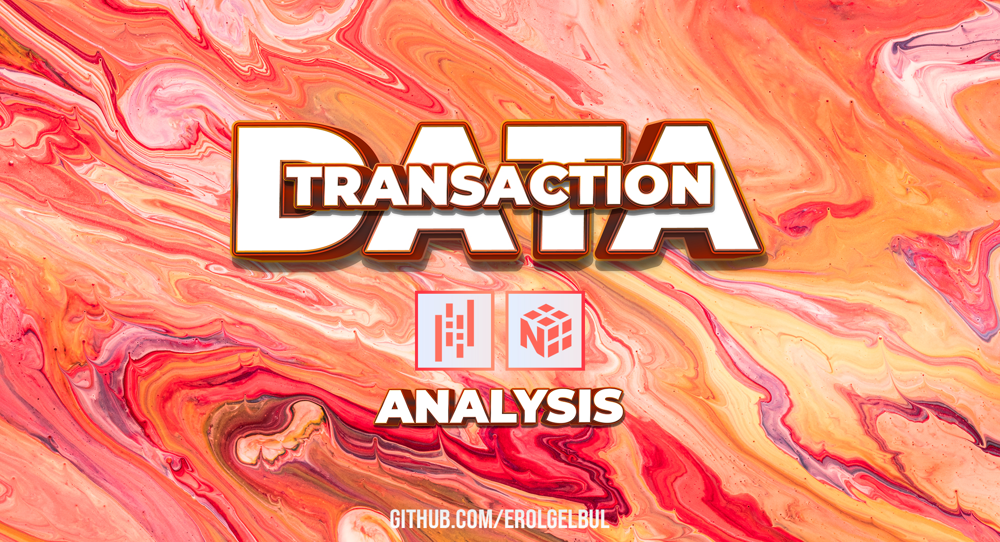

  

<!-- ABOUT THE PROJECT -->
## 1. Introduction

This project involves analyzing transaction data to gain insights into sales,
discounts, households, and products. The dataset is loaded and its memory usage
is reduced by converting columns to the appropriate data types. Missing values
and unique counts for household_key and PRODUCT_ID are calculated.

Two new columns are created: total_discount and percentage_discount. The
individual discount columns are dropped. The percentage_discount column is
capped at 1 and set to 0 if it's less than 0.

Various statistics are calculated, such as total sales, total discount, overall
percentage discount, total quantity sold, and sales value per basket and per
household.

For household analysis, the distribution of total sales value purchased at the
household level is plotted. Top 10 households by quantity and sales value are
identified. Total sales value for the top 10 households is plotted as a bar
chart.

For product analysis, the top-selling products are determined by sales value,
and their average discount rates are compared. The names of the top 10 products
by sales are looked up using the products.csv dataset. The most common
PRODUCT_ID among rows with the top 10 households by sales value is found. The
name of the item with the highest quantity sold in a single row is also looked
up.

## 1.1 Libraries

- [NumPy](https://numpy.org/)
- [pandas](https://pandas.pydata.org/)

<!-- CONTACT -->
## 2. Contact

Erol Gelbul - [Website](erolgelbul.com)

Project Link: [Transaction Data Analysis](https://github.com/ErolGelbul/transaction_data_analysis)

(<a href="#top">back to top</a>)

